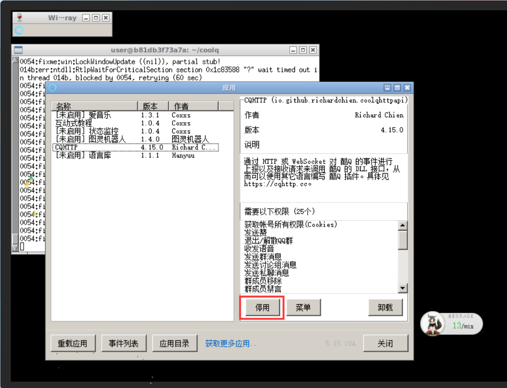
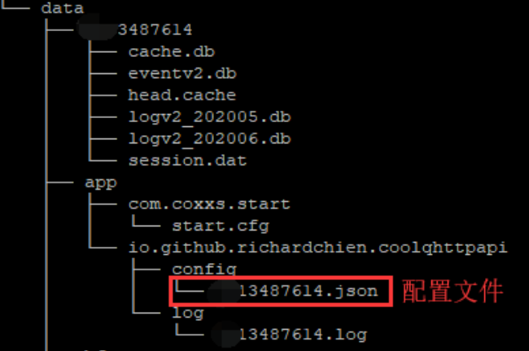

####	没想到居然还能有人star了，怕不是手滑了！

由于CoolQ机器人免费版的功能有所限制，七宝已经跑去研究其他的机器人了。这边更新完全看心情了。

------

讲一下写这个机器人过程：在这里要先感谢一下[萌萌新](https://github.com/LiChen233/simple-robot)的源码和帮助

#### 第一步、基于Spring和Cqhttp这个代码

建议spring项目，不说了。

三个不明所以的文件：

DemoApplication.java

```java
@SpringBootApplication
public class DemoApplication {
	public static void main(String[] args) {
		// SpringApplication.run(DemoApplication.class, args);
		CoolQHttpApplication application = new CoolQHttpApplication();
		application.run(QQRunApplication.class);
	}
}
```

QQRunApplication.java

```java
@SimpleRobotApplication(resources = "/conf.properties")
public class QQRunApplication implements CoolQHttpApp {
    @Override
    public void before(CoolQHttpConfiguration configuration) {
        // TODO Auto-generated method stub
    }
    @Override
    public void after(CQCodeUtil cqCodeUtil, MsgSender sender) {
        // TODO Auto-generated method stub
    }
}
```

conf.properties

```properties
core.bots = :http://127.0.0.1:5700
core.logLevel = DEBUG

cqhttp.javaPort = 8090
cqhttp.serverPath = /coolq
```

pom.xml

```xml
    <!-- 酷Q开发组件 -->
    <dependency>
      <groupId>io.github.ForteScarlet.simple-robot-core</groupId>
      <artifactId>component-forcoolqhttpapi</artifactId>
      <version>0.9.0-BETA-1.9</version>
    </dependency>
```

没什么好改的照着原文档抄就好了。初始化机器人并加载conf.properties中的配置。

后面就是编写监听文件，也就是GroupMsgListenerDemo.java，基本格式

```java
	@Listen(MsgGetTypes.groupMsg) //监听消息类型：群消息
	@Filter(keywordMatchType = KeywordMatchType.TRIM_CONTAINS, value = "天气") //筛选消息内容：包含天气文本的群消息，具体的匹配条件可以ctrl点KeywordMatchType进文件详细查看。
    public void groupMsg(GroupMsg msg, MsgSender sender) throws IOException {
        //GroupMsg 群消息信息
        //MsgSender 消息发送组件
        String send_str = "你查nm的天气呢？劳资会写吗？";
        sender.SENDER.sendGroupMsg(msg.getGroup(), send_str);
    }
```

监听消息并发消息基本就是这样了你的机器人也可以配合酷Q码来实现消息多样化。

其他和机器人无关就不讲了。

#### 第二部、你的酷Q air基于Linux平台的

还是很简单的。这里我没有使用cqhttp中的那个docker镜像，之前用起来有点烦。最后还是用了最基本的wine-coolq镜像。

```shell
yum install docker -y  #安装docker
systemctl start docker  #启动docker
docker search coolq  #查看coolq镜像 star最多的那个
docker pull wine/coolq  #拉取coolq 这一步较慢，看服务器性能
cd /home #指定文件夹
docker run -d --name=coolq -p 9000:9000 -p 5700:5700 -v $(pwd)/coolq:/home/usr/coolq wine/coolq  
#创建名为coolq的容器，
#创建端口映射将容器内端口9000与5700和服务器的9000与5700关联，
#创建文件映射将容器内的目录/home/usr/coolq与当前目录$(pwd)/coolq关联，这样就可以在外面修改容器内的配置了
#最后使用wine/coolq镜像来创建容器
```

下载cqhttp插件:

```shell
cd coolq/app && wget https://github.com/richardchien/coolq-http-api/releases/download/v4.15.0/io.github.richardchien.coolqhttpapi.cpk
```

启用插件在通过ip：9000端口登录CoolQ启用插件，建议跟着官方文档走。



配置文件：qq.json



```json
{
    "$schema": "https://cqhttp.cc/config-schema.json",
    "host": "0.0.0.0",
    "port": 5700,
    "use_http": true,
    "ws_host": "0.0.0.0",
    "ws_port": 6700,
    "use_ws": false,
    "ws_reverse_url": "",
    "ws_reverse_api_url": "",
    "ws_reverse_event_url": "",
    "ws_reverse_reconnect_interval": 3000,
    "ws_reverse_reconnect_on_code_1000": true,
    "use_ws_reverse": false,
    "post_url": "http://公网ip:8090/coolq",  #这个也是你的spring程序的上报/监听接口。
    #由于docker内部网络和主机网络的不同，所以我就不用去调试什么桥接模式了，直接拿公网ip来使用，能访问到就行了。
    "access_token": "",
    "secret": "",
    "post_message_format": "string",
    "serve_data_files": false,
    "update_source": "global",
    "update_channel": "stable",
    "auto_check_update": false,
    "auto_perform_update": false,
    "show_log_console": true,
    "log_level": "debug"
}
```

#### 第三步、打包你的spring程序到服务器上运行

还是由于127.0.0.1用多了，想要一起起作用还是要放在相同的环境下才行。

~~打包这里遇到的问题可能就是本体一些json,txt文件打不进包里吧。修改了一下pom.xml调整了mvn的工作方式，最后还是解决了。~~实际的问题是，使用File类获取本地资源文件在项目被打包之后失效了，最后是替换了org.springframework.core.io来处理了这个问题。代码实例对比：~~不对比了，我已经改了。~~

```java
	/**
     * @author Qibao
     * @param lineNumber
     * @return String
     * @see 读取TxT文件中指定的一行,打包后springFromworke框架导致java.io.File类失效，重写文件读取方式。使用org.springframework.core.io库
     */
public static String getLine(int lineNumber) {
    	String filePath = "classpath:shadiaoapp.txt";
        String lineTXT = null;
        try {
            InputStream in = getInputStream(filePath);
            if (in != null) {
                InputStreamReader iStreamReader = new InputStreamReader(in);
                BufferedReader br = new BufferedReader(iStreamReader);
                // 打印指定一行
                for (int i = 0; i < lineNumber; i++) {
                    lineTXT = br.readLine();
                }
                // System.out.println(lineTXT);
                br.close();
            } else {
                System.out.println("文件读取错误");
            }
        } catch (Exception e) {
            // TODO: handle exception
            System.out.println("文件读取错误");
        }
        return lineTXT;
    }
```

将项目打包好之后，放在服务器上

```shell
screen -R cool #可以不用
java -jar qqrebot-0.0.1-SNAPSHOT.jar #在文件所在的位置执行就好了
```


